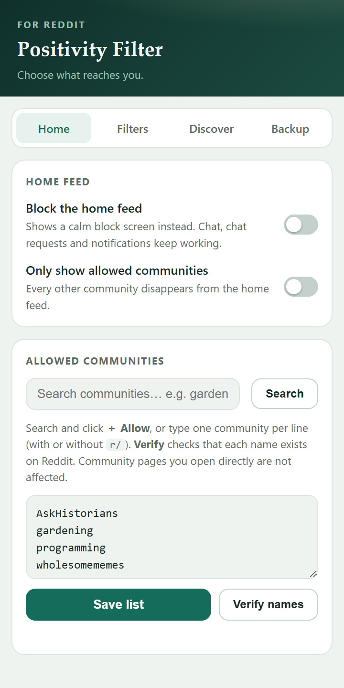
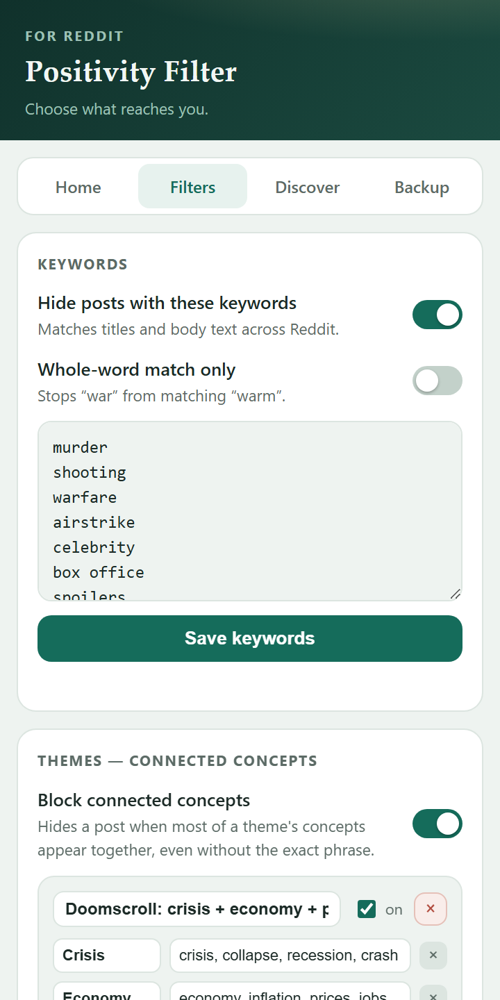
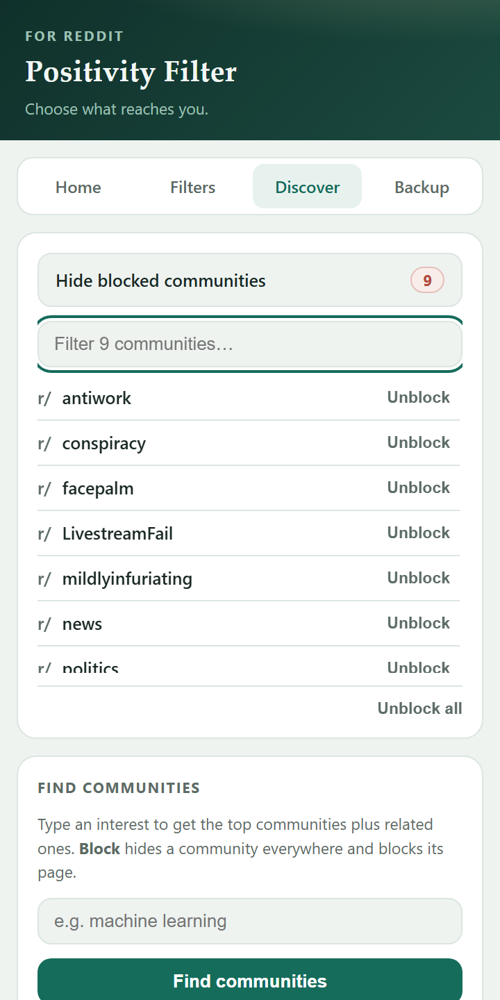
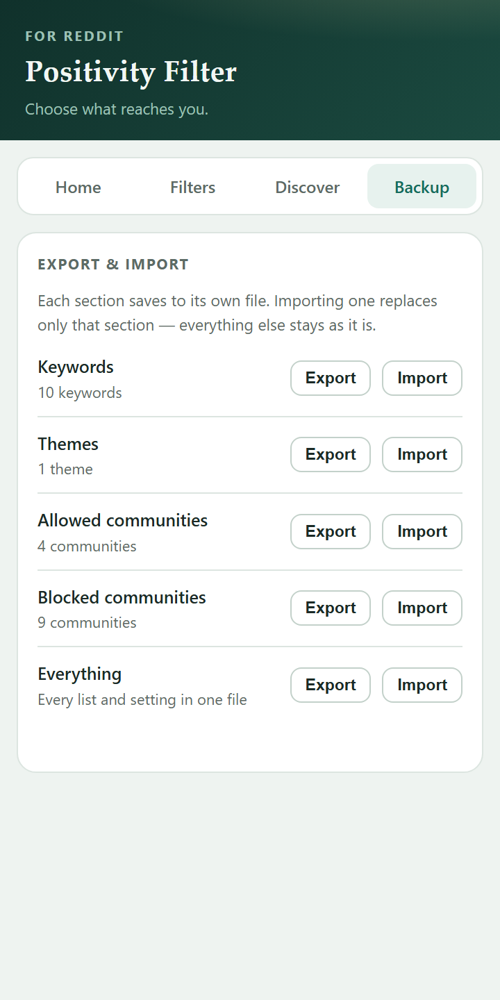

# 🛡️ Reddit Positivity Filter

[](https://github.com/Rishabh-creator601/Reddit-filters/releases)
[](https://github.com/Rishabh-creator601/Reddit-filters/releases/latest)


A privacy-first Chrome / Edge extension that puts **you** in charge of what Reddit shows you:

- **Your home feed, on your terms** — allow only the communities you choose, or switch the feed off entirely (chat and notifications keep working).
- **Negativity filtered out** — keyword lists and concept-based themes that catch a topic without you listing every phrasing.
- **Nothing leaves your browser** — no servers, no tracking, no accounts, no bundled third-party code.

**Jump to:** [Download](#%EF%B8%8F-download) · [Features](#-features) · [Install](#-install-developer-mode--30-seconds) · [How to use](#-how-to-use) · [Privacy](#-privacy) · [FAQ](#-faq)

---

## 📸 Screenshots

<table>
<tr>
<td align="center" width="25%"><b>Home</b></td>
<td align="center" width="25%"><b>Filters</b></td>
<td align="center" width="25%"><b>Discover</b></td>
<td align="center" width="25%"><b>Backup</b></td>
</tr>
<tr>
<td></td>
<td></td>
<td></td>
<td></td>
</tr>
<tr>
<td align="center"><sub>Allow only what you choose</sub></td>
<td align="center"><sub>Words, and whole concepts</sub></td>
<td align="center"><sub>Blocked list, plus the finder</sub></td>
<td align="center"><sub>Each list backs up on its own</sub></td>
</tr>
</table>

---

## ⬇️ Download

**[⬇️ Download reddit-positivity-filter.zip](https://github.com/Rishabh-creator601/Reddit-filters/releases/latest/download/reddit-positivity-filter.zip)** — then follow the [install steps](#-install-developer-mode--30-seconds) below.

*(Downloads are counted via GitHub Releases — see the downloads badge above.)*

---

## ✨ Features

### Take control of your home feed

| Feature | What it does |
|---|---|
| 🏡 **Allowlist mode** | **Only the communities you allow appear on your home feed** — every other community's posts are silently removed. Build the list safely: search Reddit inside the popup and click **＋ Allow**, or type names and **Verify** them against Reddit so typos can't slip in. |
| 🔒 **Full block mode** | Replace the home feed with a calm block screen. 💬 Chat (including chat requests) and 🔔 notifications are **never** blocked — the block screen links straight to both, and its built-in 🔎 community search lets you find and open communities without ever seeing the feed. |
| ⛔ **Block any community** | A floating **Block** button on every subreddit, plus **Block** buttons in the finder. Blocked communities vanish from every feed, their pages are blocked, and they're never recommended. |

### Filter out negativity

| Feature | What it does |
|---|---|
| 🧹 **Keyword filter** | Hides posts/comments mentioning topics you choose — ships with a starter list covering violence, abuse, cheating, profanity, celebrity/film-industry and warfare. Fully editable, with an optional strict whole-word mode. |
| 🧩 **Theme filter (concept blocking)** | Blocks a post when a **majority of a theme's concepts appear together** — e.g. *safety + women + country + laws* — even if you never typed the exact phrase. Each concept is a few seed words; a live **Test it** box shows exactly why a post would block. |

### And the practical bits

| Feature | What it does |
|---|---|
| 🔎 **Community finder** | Type an interest (e.g. *machine learning*) and get the top ~20 relevant communities, including related topics, ranked by relevance + popularity. |
| 💾 **Per-section backup** | Export and import **each section on its own** — keywords, themes, allowed communities, blocked communities — so restoring one never overwrites another. An **Everything** file covers a full move to a new machine. |

---

## 🔧 Install (Developer Mode — ~30 seconds)

1. **[Download the ZIP](https://github.com/Rishabh-creator601/Reddit-filters/releases/latest/download/reddit-positivity-filter.zip)** and unzip it (or `git clone` this repo).
2. Open **Chrome** → `chrome://extensions` (Edge → `edge://extensions`).
3. Turn on **Developer mode** (top-right).
4. Click **Load unpacked** and select the unzipped folder.
5. Open **reddit.com** — filtering starts immediately. Click the toolbar icon for settings.

> Updating the code later? Click the **↻ reload** icon on the extension card and refresh your Reddit tab.

---

## 📖 How to use

Click the toolbar icon to open the popup. It has four tabs — **Home**, **Filters**, **Discover** and **Backup**.

### Home — your home feed, your rules

- **Block the home feed** — replaces the feed with a block screen. Chat, chat requests and notifications keep working; the block screen links to both and includes a community search.
- **Only show allowed communities** — every community not on your list disappears from the home feed. Community pages you open directly are not affected.
- **Allowed communities** — build the list without guessing names:
  - **Search** a topic and click **＋ Allow** on real communities (correct spelling guaranteed — they come from Reddit itself), or
  - type names one per line (with or without `r/`) and click **Verify names** — each one is checked against Reddit, capitalization is fixed, and typos are flagged in red.

### Filters — words and themes

- **Keywords** — flip **Hide posts with these keywords** on, edit the list (one word or phrase per line), and **Save keywords**. **Whole-word match only** reduces false hits (stops "war" matching "warm").
- **Themes** — define a *theme* as a few **concepts** (each a short list of seed words). A post is blocked when a majority of the concepts appear together, so you catch a whole topic without listing every phrasing. Tune how many concepts must connect, preview matches with the **Test it** box, and **Save themes**. Ships with an editable starter theme.

### Discover — find & block communities

- **Show blocked communities** expands a tidy list of everything you've blocked, sorted A–Z, each with its own **Unblock**. Past eight entries you get a filter box; **Unblock all** asks for a second click before it clears the list.
- Type an interest and press **Find communities** — top results plus related topics, each with a **Block** button.

### Backup — export & import, section by section

Each section has its own **Export** and **Import**, and each writes its own file:

| Section | File |
|---|---|
| Keywords | `rpf-keywords.json` |
| Themes | `rpf-themes.json` |
| Allowed communities | `rpf-allowed-communities.json` |
| Blocked communities | `rpf-blocked-communities.json` |
| Everything | `rpf-backup.json` |

Importing a section replaces **only** that section — your other lists are left untouched. An **Everything** file also works as the source for any single section, so you can pull just your keywords out of a full backup.

### On Reddit itself

- A floating **🚫 Block r/…** button appears on every community page. One click blocks it everywhere.
- Hidden posts show a small "🚫 Hidden" bar. Keyword matches offer **Show anyway**; blocked communities and theme matches are hard-hidden with no reveal.

---

## 🔒 Privacy

- **No external servers.** All keyword and theme filtering runs entirely in your browser.
- **No third-party code.** The extension ships nothing but its own vanilla JS — no libraries, no bundles, no WebAssembly.
- The community finder talks **only to Reddit's own API**, using your existing session.
- Settings live in Chrome's extension storage and sync only through your own browser profile.
- No analytics, no telemetry, no accounts.

---

## ❓ FAQ

**Does it work on old Reddit?**
Yes — both new Reddit (`www.reddit.com`) and `old.reddit.com` are supported.

**Will blocking the home feed break chat or notifications?**
No, by design. Chat (`chat.reddit.com`, including chat requests) and notifications are explicitly exempt from every block this extension applies.

**A post slipped through — why?**
Keyword matching is text-based: if the post's text doesn't contain a listed word, it won't match. Add the missing word, or create a theme for the topic so it's caught by concept rather than by exact phrasing. Text that lives only inside an image isn't read.

**Can my settings move to another computer?**
Yes — **Backup → Everything → Export** writes one JSON file you can **Import** elsewhere, or move a single section with its own file. Chrome sync also carries settings between browsers where you're signed in.

---

## 🗂️ Project structure

Only the first five entries and `icons/` are shipped in the extension package —
everything else is documentation and listing material.

```
manifest.json           Extension config (Manifest V3)
content.js              Filtering, home-feed allowlist/block, community blocking, finder
content.css             Styles for hidden posts, block screens, block button
popup.html/js           Toolbar popup (Home / Filters / Discover / Backup tabs)
icons/                  Extension icons (16/32/48/128) referenced by the manifest
│
docs/screenshots/       Raw popup captures, used in this README and as build inputs
store/                  Chrome Web Store listing assets — see store/README.md
├─ icon/                  128×128 store icon
├─ screenshots/           1280×800 listing screenshots, in display order
└─ promo/                 440×280 small tile + 1400×560 marquee
tools/                  Asset generation (icons, store screenshots and banners)
```

### Packaging for the Web Store

```bash
python tools/make_store_assets.py   # regenerate listing images after a UI change
```

The uploadable `reddit-positivity-filter.zip` contains only `manifest.json`, the
four source files and `icons/` — no docs, listing art or tooling.

---

## ⚙️ Tech

- Manifest V3 · vanilla JS · no build step · no dependencies
- Reddit's public JSON API — community search & verification
- Listing images generated by `tools/make_store_assets.py` (Pillow)
